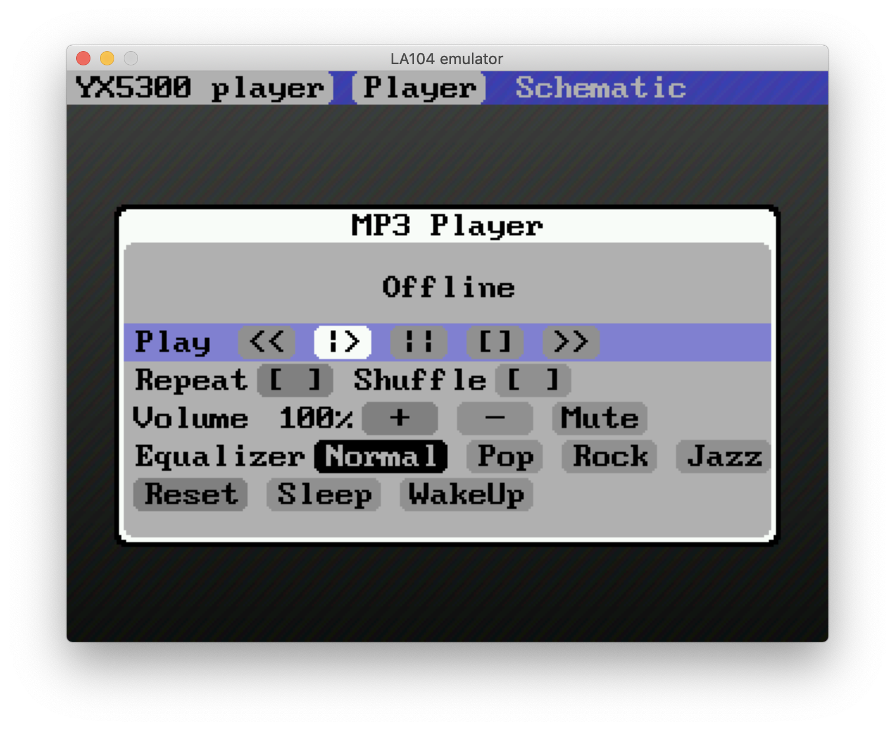
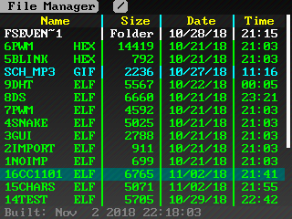
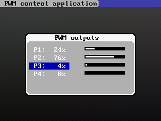
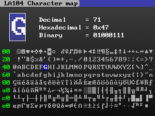
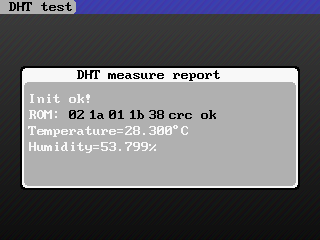
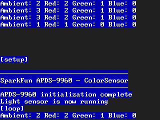
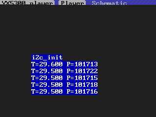
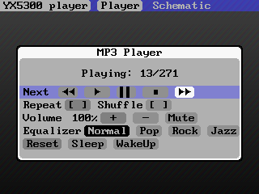

# LA104 pocket logic analyser operating system

LA104 is another nice piece of handheld hardware coming from [e-design / miniware company](http://www.miniware.com.cn/) similar to their previous product - pocket digital storage oscillosope DS203. 

This time they designed wholly digital device without analog circuitry featuring 4 general purpose IO signals and 4 digital inputs processed by [AG1K FPGA chip](http://www.alta-gate.com/products.aspx?id=43&p=14), the processor used is the same as in DS203 - STM32F103VCT6. Device is battery powered, charged through USB micro connector, its display offers resolution of 320x240 pixels and the storage EEPROM has this time capacity of 8MB. Check the [scheme here](resources/LA104%20V1.5B_SCH.pdf)

Flashing is done by holding first function button during powering up and by copying firmware HEX file onto the virtual flash USB drive formatted as FAT12. This could be tricky, since this approach does not work on Mac OSX. For some reason the default copying procedure after mounting this USB drive on OSX is different than the programmers at e-design expected, it works reliably only on Windows machines. During extensive research and testing I found a method how to upload firmware on any unix/linux operating system. Just build [tools/dfuload](tools/dfuload) by running build.sh script and you are ready to flash new firmwares. 

When I was developing alternative firmware for DS203, I was trying to design some simple operating system that would allow me to upload easily new programs to the devie with ability to switch between them without flashing it again. Something similar that [jpa did before](https://jpa.kapsi.fi/dsoquad/) with his PAWN interpreter on DS203 with a little difference that the application will be native C/C++ compiled code offering full computational power of the device. Unfortunately the GCC toolchain I was using had some bug which produced ARM32 instructions in PLT section which are not supported by STM32F103 and I was not able to force the compiler to use Thumb instruction set. So the dynamic relocation of imported symbols was an impossible task to implement. Now after few years, this problem was fixed and finally I could continue developing this operating system I have started before.

#### News

##### Logic sequencer app

16 channel logic analyser and sequencer. Generator of 4 bit pattern attached to CD4543 BCD to seven segment decoder. PCF8574 used as 16 bit expander

##### Midi player - midi parser and player

Connect your midi keyboard with two wires (3V and P1 through 100-330 ohm resistor).

https://www.youtube.com/watch?v=-MRcrPu_1kQ

#### In this repository you will find

  - [resources](resources) - official resources from manufacturer, shematics and memory layout information
  - [experiments](experiments) - the first simple applications to verify if we have proper toolchain, libraries, linker script and startup code
      - blink - When getting familiar with new hardware platform, this is the most common application - just blink a LED attached to P1 port. It is worth noting that the P1..P4 pins are connected always to two different IO pins of the MCU. This allows you to use each pin as general purpose IO pin, or as UART or I2C bus signal. For example pin P1 is connected to MOSI_PB15 and T23_TX3_SCL2_PB10. And P2 is connected to MISO_PB14 and T24_RX3_SDA2_PB11. So be very careful when configuring the IO pins so you won't create a short circuit 
    - triangle_oldlib - code taken from DS203 project. Draws simple sierpinski fractal to test LCD in C language
    - triangle_newlib - the same code, but with new library (2012 instead of 2008), this library is taken from official LA104 firmware project  
    - triangle_cpp - the same code, but in C++ with linker script that supports C++ features
    - worm - project taken from DS203, simple worm game but the controls are not very intuitive. Just a demonstration of simple event based window system
    - dynamic_simple - first step towards building own operating system, main application ELF just calls few imported functions (Test1, Test2, Test3, Test4). Imported library (shared object) has only empty implementation of those functions Test1..Test4 functions so the linker won't shout at us during compilation. Then by using [tools/elfdump](tools/elfdump) utility, a C code [dump.c](experiments/dynamic_simple/dump/dump.c) is generated which shows what will be loaded in which memory regions during ELF load process. [Secondary application](experiments/dynamic_simple/secondary/main.c) then calls this generated code and matches all imports into real functions
    - dynamic_advanced - the same, but this time the code is organized in three folders - library, host and client application. Instead of dummy functions, this time imported functions are putpixel and random.
  - [official_fw_gcc](official_fw_gcc) - official LA104 firmware ported to use GCC compiler. No need to use IAR workbench. Only slight changes were done in the code - e.g. replacing sprintf function with malloc independent version of this function. 
  - tools - various commandline tools
    - [dfuload](tools/dfuload) - DFU load utility mentioned before
    - [elfstrip](tools/elfstrip) - utlity to remove unnecessary parts from ELF file
    - [elfdump](tools/elfdump) - shows some information about ELF file structure and dumps used memory regions as C code
  - [system](system) - LA104 custom firmware / operating system 
    - [bin](system/bin) - here you will find main firmware HEX file (manager.hex) and few interesting applications. At first flash the manager.hex in DFU mode and after reboot, copy these ELF files to the device using USB cable
    - os_host - operating system implementation with file manager and ELF loader
    - os_library - dummy library used by client applications during linking
    - apps_experiments - TBD
      - test1_noimport - simple application without importing any symbols. Just uses LA104 bios to draw some image. For testing whether the ELF file was properly generated and stripped and if it loads succesfully
      - test2_import - the same application, but it imports BIOS::KEY::GetKey to properly exit the application when pressing second button and BIOS::LCD::PutPixel instead of using LA104 bios function
      - test3_gui - some simple GUI rendering, with text drawing and windows
      - test5_blink_hex - instead of ELF, this is just bare HEX file which is loaded into RAM to prevent FLASH rewrites. Just blinks the LED attached to P1 pin
      - test6_pwm_hex - first experiments with configuring 4 channel PWM, as well as previous program it loads the code into RAM. After finetuning and transferring the PWM code into host app, test7_pwm_app was made
      - test8_ds_app - reads the scratchpad of DS1820 / DS18B20 thermometer and shows temperature reading using GPIO api calls developed in test5_blink_hex
      - test9_dht - the same but with DHT22 temperature / humidity sensor
      - test10_i2c_direct - again with core library files to configure I2C transceiver to interface with BMP180 (BMP085) barometric pressure sensor. After merging this support code into host app, test11_i2c_api was made
      - test12_uart_api - after adding support code to host, this is the api test for UART on pins P1 & P2 (no other pins support HW uart on LA104)
      - test16_cc1101 - CC1101 transceiver sniffing Oregon scientific weather station sensors
    - apps_arduino - demonstration how to use arduino libraries in LA104
      - test11_i2c_api - interfacing BMP180 (BMP085) arduino library with I2C api calls
      - test14_apds9960 - again I2C communication with APDS9960 color sensor / gesture recognizer. This time with original sparkfun arduino library and sample code without almost any changes. Showing how to run your arduino code directly on LA104
    - apps - some applications worth trying
      - test4_snake - just snake game, not easy to control with the rotating encoders
      - test7_pwm_app - gui application for controlling PWM outputs, great tool for playing with RGB leds
      - test13_mp3 - mp3 player gui application, works with MD_YX5300 module
      - test15_charmap - shows ASCII character table used by OS
    - hybrid - run any application as OSX native app for debugging and designing layouts

#### Screenshots

#### Features
  - add snapshotting to host app - DONE (23screen.elf)
  - c++ global variables memory placement, currently all variables on stack - DONE (fixed linker script)
  - DS1820 network scanner app (50% done, 18onew.elf)
  - API signals: file added / fat changed, usb connection/disconnection (50% done, GetIntVect/SetIntVect)
  - PCF8574 sequencer + BCD to 7 segment test application (95%, 22sequen.elf)
  - midi player app (95%, 21mplay.elf)

#### TODO list

  - CC1101 RF waveform recorder / player (10%, not enough IO pins)
  - relative paths in app arguments
  - Graphical shell with icons
  - finish GIF loading, or consider other image formats (PCX, LBM, BMP?)
  - beeper
  - remote control using ESP or BLE - possible to attach to UART0? (not possible, use USB CDC instead)
  - USB toolkit - serial port, midi device, HID keyboard and mouse emulator, joystick (10%)
  - hybrid app use relative paths
  - consider using cmake for hybrid app
  - obtain FPGA code from manufacturer 
  - setup FPGA build environment
  - what toolchain to use, how to install...
  - add desc: toolchain, building, ld script?
  - CNC g code decoder and player
  - swiss army knife for hardware engineers - package of applications that can talk to any electronic device and monitor any digital bus
