

# LA104 pocket logic analyser operating system

LA104 is another nice piece of handheld hardware coming from [e-design / miniware company](http://www.miniware.com.cn/) similar to their previous product - pocket digital storage oscillosope DS203. 

This time they designed wholly digital device without analog circuitry featuring 4 general purpose IO signals and 4 digital inputs processed by [AG1K FPGA chip](http://www.alta-gate.com/products.aspx?id=43&p=14), the processor used is the same as in DS203 - STM32F103VCT6. Device is battery powered, charged through USB micro connector, its display (ILI9341) offers resolution of 320x240 pixels and the storage EEPROM has this time capacity of 8MB. Check the [scheme here](resources/LA104%20V1.5B_SCH.pdf)

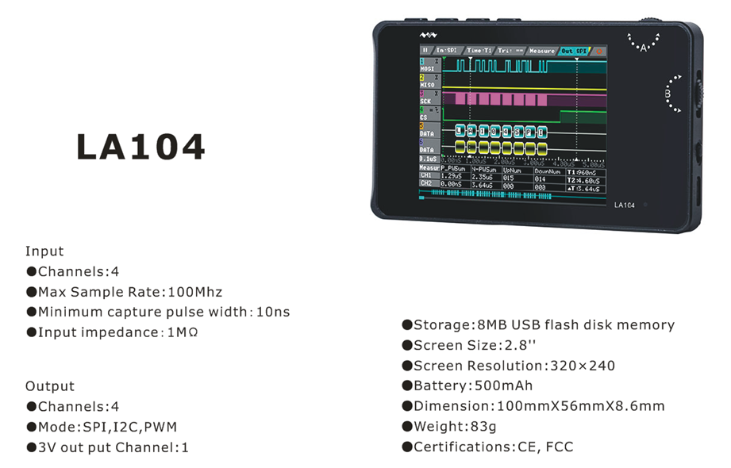

When I was developing [alternative firmware](....) for DS203, I was trying to design some simple operating system that would allow me to upload easily new programs to the devie with ability to switch between them without flashing it again. Something similar that [jpa did before](https://jpa.kapsi.fi/dsoquad/) with his PAWN interpreter on DS203 with a little difference that the application will be native C/C++ compiled code offering full computational power of the device. Unfortunately the GCC toolchain I was using had some bug which produced ARM32 instructions in PLT section which are not supported by STM32F103 and I was not able to force the compiler to use Thumb instruction set. So the dynamic relocation of imported symbols was an impossible task to implement. Now after few years, this problem was fixed and finally I could continue developing this operating system I have started before.

#### Installation

Go to release section of this page, find latest version for your device (there are releases for LA104, DS203 and DS213) and download *system.hex*. Power on the LA104 while holding first button. Connect the device using USB cable with your computer. New disk drive should appear, copy the *system.hex* file there. The disk should disconnect and reconnect shortly after the upload was finished. If you are lucky, you will see *system.rdy* on the disk. Turn the unit off and on and copy remaining files from zip archive *la104apps.zip* to your device. After power cycle a gui should appear. For Linux/OSX systems use [tools/dfuload](tools/dfuload) script to copy the firmware, if the file system does not appear stable, you can format it using [tools/dfuload/format.sh](tools/dfuload/format.sh) script.

#### Building

Refer to this [tutorial](resources/tutorial_building)

#### Online demo

[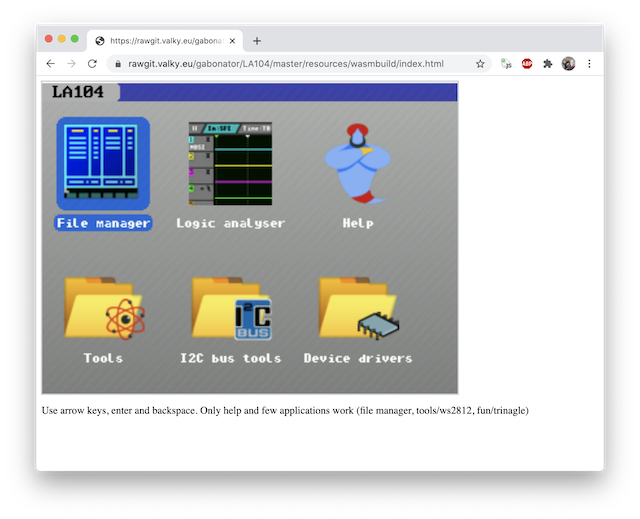](https://rawgit.valky.eu/gabonator/LA104/master/resources/wasmbuild/index.html)

#### Repository structure

  - resources - old projects, screenshots used in this document and tutorials
  - tools
    - dfuload - copies the firmware to the device, works for DS203, DS213 and LA104 on linux/osx
    - elfstrip - reduces the size of ELF images, used by all application building scripts
    - fpga - FPGA images and scripts for downloading images using openocd
    - midiconv - converts multichannel midi files into single channel (single data stream), so it can be played without seeking
    - openocd - notes on how to flash DS213 over SWD interface and how to debug the apps in Microsoft Visual Code
    - rtl433 - rtl433 clone modified to be used as WASM binary in web browser/javascript
    - shellicons - icons used in LA104 visual shell
    - stm32flash - recovery tool for DS203
  - system
    - apps - working applications mainly for LA104
    - apps_ds213 - applications for DS213/DS203
    - apps_experiments - arduino sample code interfacing some sensors and experimental applications. Use this as reference code for your projects. Mostly just simple console applications
    - apps_featured - advanced applications with full visual interface
    - apps_shell - file lister and graphical application switcher
    - apps_usb - apps simulating various USB peripherals
    - os_host - system source code, actually an application which loads ELF files from filesystem, matches the imported symbols and loads them
    - os_library - dummy library exposing all functions of the system. Necessary for building all applications
    - os_platform - support files for building for other platforms than Arm (Win32, OSX XCode or WASM)
    - scripts - [building scripts](resources/tutorial_building#building-scripts)

#### Applications in LA104 package

| Icon | Group | App name | App project / video |
|------|-------|----------|---------------------|
| 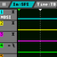 |  | Logic analyser | [apps/test17_official](system/apps/test17_official/) |
|  |  | Device info | [apps_featured/61_devinfo](system/apps_featured/61_devinfo/) |
|  |  | File manager | [apps_shell/test29_fileman](system/apps_shell/test29_fileman/) |
| 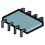 | devices | APDS9960 color gesture sensor | [apps_experiments/test14_apds9960](system/apps_experiments/test14_apds9960/) |
|  | devices | BMP085 Barometric sensor | [apps_experiments/test11_i2c_api](system/apps_experiments/test11_i2c_api/) |
|  | devices | BMP180/BMP085 barometer | [apps_experiments/92_bmp180](system/apps_experiments/92_bmp180/) |
|  | devices | DHT11/DHT22 temperature humidity | [apps_experiments/test9_dht_app](system/apps_experiments/test9_dht_app/) |
|  | devices | DS1307 real time clock | [apps_experiments/test56_ds1307](system/apps_experiments/test56_ds1307/) |
|  | devices | DS3231 real time clock | [apps_experiments/test57_ds3231](system/apps_experiments/test57_ds3231/) |
|  | devices | ESP8266 uart wifi server | [apps/test36_esp_server](system/apps/test36_esp_server/) |
|  | devices | MAX7219 display driver | [apps_experiments/84_max7219](system/apps_experiments/84_max7219/) |
|  | devices | MLX90614 non cotact thermo | [apps_unfinished/87_mlx90614](system/apps_unfinished/87_mlx90614/) |
|  | devices | MPR121 12 channel toch sensor | [apps_experiments/106_mpr121](system/apps_experiments/106_mpr121/) |
|  | devices | PCF8591t I2C ADC | [apps/test34_scope](system/apps/test34_scope/) |
|  | devices | SHT20 temperature humidity | [apps_experiments/95_sht20](system/apps_experiments/95_sht20/) |
|  | devices | SIMCOM gprs modem | [apps/test45_simcom](system/apps/test45_simcom/) |
|  | devices | TM1637 7-segment display | [apps_experiments/96_tm1637](system/apps_experiments/96_tm1637/) |
|  | devices | YX5300 MP3 player | [apps/test13_mp3](system/apps/test13_mp3/) |
|  | display | eInk display image loader | [apps_featured/90_epd_image](system/apps_featured/90_epd_image/) |
|  | display | Image viewer | [apps/81_image](system/apps/81_image/) |
|  | display | SSD1306 oled test | [apps_experiments/102_ssd1306](system/apps_experiments/102_ssd1306/) |
|  | fun | Rotating cube | [apps/99_3d](system/apps/99_3d/) |
|  | fun | Scroll test | [apps_experiments/test39_lcd](system/apps_experiments/test39_lcd/) |
|  | fun | Snake game | [apps/test4_snake](system/apps/test4_snake/) |
|  | fun | Sierpinski triangle | [apps_experiments/test2_import](system/apps_experiments/test2_import/) |
| 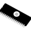 | i2c | I2C EEPROM memory viewer | [apps_featured/85_i2ceeprom](system/apps_featured/85_i2ceeprom/) |
|  | i2c | I2C bus scanner | [apps_featured/test37_i2cscan](system/apps_featured/test37_i2cscan/) |
|  | rftools | RF analyser synthesizer | [apps_featured/80_rftool/test](system/apps_featured/80_rftool/test/) [https://youtu.be/Gwyi00NKBNg](https://youtu.be/Gwyi00NKBNg) |
|  | rftools | Spectrum analyser | [apps/82_specan](system/apps/82_specan/) [https://youtu.be/Gwyi00NKBNg](https://youtu.be/Gwyi00NKBNg) |
|  | rftools | WebUSB rf analyser | [apps/79_cc1101osc](system/apps/79_cc1101osc/) [https://youtu.be/Gwyi00NKBNg](https://youtu.be/Gwyi00NKBNg) |
|  | tools | Atmel firmware flasher | [apps/105_avrprogrammer](system/apps/105_avrprogrammer/) [https://youtu.be/yC3a1zbonJ0](https://youtu.be/yC3a1zbonJ0) |
|  | tools | Character map | [apps/test15_charmap](system/apps/test15_charmap/) |
|  | tools | DCF77 decoder | [apps/test30_dcf77](system/apps/test30_dcf77/) |
|  | tools | DS1820 temperature grapher | [apps_featured/test33_temper](system/apps_featured/test33_temper/) |
|  | tools | GPIO and PWM controller | [apps_featured/test49_gpio](system/apps_featured/test49_gpio/) |
|  | tools | MIDI player | [apps_featured/test21_midiplay](system/apps_featured/test21_midiplay/) [https://youtu.be/f3DCqy-3lNo](https://youtu.be/f3DCqy-3lNo) |
| 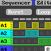 | tools | Sequencer and analyser | [apps/test22_sequencer](system/apps/test22_sequencer/) [https://youtu.be/D8OnXzE7OwU](https://youtu.be/D8OnXzE7OwU) |
| 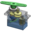 | tools | Servo controller PCA9685 | [apps_featured/103_servo](system/apps_featured/103_servo/) [https://youtu.be/heYFrqVF1P4](https://youtu.be/heYFrqVF1P4) |
|  | tools | UART monitor | [apps_featured/72_uartmon](system/apps_featured/72_uartmon/) |
|  | tools | Invt VFD RS485 visualizer | [apps_featured/74_invtvisual](system/apps_featured/74_invtvisual/) [https://youtu.be/0Ns7AHVvmX0](https://youtu.be/0Ns7AHVvmX0) |
| 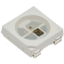 | tools | WS2812 addressable led tester | [apps_featured/test63_ws2812](system/apps_featured/test63_ws2812/) [https://youtu.be/4fWqZBbjQPc](https://youtu.be/4fWqZBbjQPc) |
|  | usb | Atmel ISP programmer | [apps_usb/104_avrisp](system/apps_usb/104_avrisp/) |
|  | usb | Serial link | [apps_usb/test24_usbcdc](system/apps_usb/test24_usbcdc/) |
| 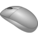 | usb | Human interface device | [apps_usb/test25_hid](system/apps_usb/test25_hid/) |
|  | usb | Midi to uart | [apps_usb/test26_midi](system/apps_usb/test26_midi/) |
    
#### News

##### Avrisp programmer

- Can be used for flashing Atmel MCUs - either for flashing HEX files directly over ICSP connector [105_avrprogrammer](system/apps/105_avrprogrammer/), or use LA104 as AVRISP USB programmer compatible with Arduino IDE [104_avrisp](system/apps_usb/104_avrisp/)

##### Docker integration

- The la104 images can be build using docker, [integration details](resources/tutorial_building#docker-builds)

##### EInk display image loader

- Application [90_epd_image](system/apps_featured/90_epd_image/) loads BMP images and transfers them into the eink display

##### RF Toolkit

Ultimate toolkit for hacking OOK/ASK wireless devices (weather stations, wireless keys...) using CC1101 transceiver

- RF Toolit application: [80_rftool](system/apps_featured/80_rftool/)
- Spectrum analyser: [82_specan](system/apps/82_specan/)
- Web usb signal analyser: [79_cc1101osc](system/apps/79_cc1101osc/)

##### (LA104) Variable frequency drive visualizer

This app uses RS485 adapter to talk to Invt Good drive inverters. Read more [here](system/apps_featured/74_invtvisual), besides the visualization tool, there is also [application](system/apps_experiments/75_invtemu) which emulates GD100 VFD (as seen on the picture)... Watch video:

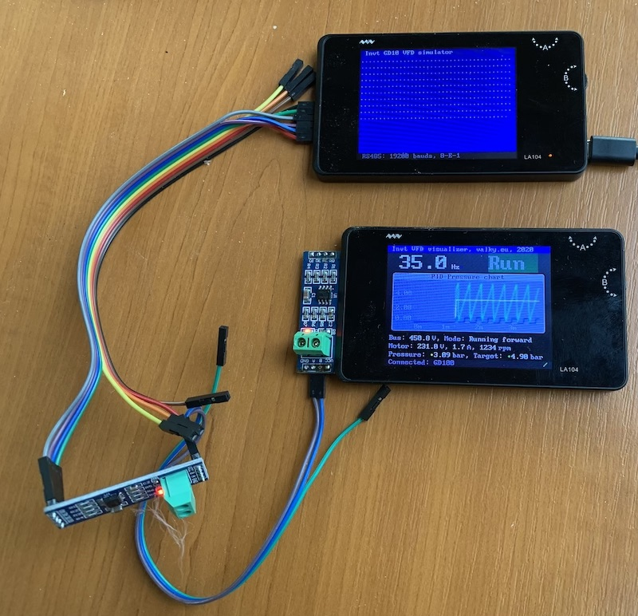

##### WASM experimental evironment

LA104 OS running in [your browser](https://rawgit.valky.eu/gabonator/LA104/master/resources/wasmbuild/index.html) using WASM technology

##### (DS203) Web USB Oscilloscope

Proud to announce the first oscilloscope in the world using the WebUsb technology (correct me if I am wrong)! [Read more here](system/apps_featured/69_webusbosc/readme.md)

Watch video here:

##### Addressable RGB led strip tester

Addressable LED tester with advanced functions. Supports up to 32x WS2812/WS2812/SK6812 and other compatible addressable LED modules. More than 15 static and dynamic color presets, speed control, 8 different filter post-process options... Possible to build for OSX as desktop application, or LA104 native app or as [WASM based HTML application. Try it online here!](http://rawgit.valky.eu/gabonator/LA104/master/system/apps_featured/test63_ws2812/build_wasm/index.html) Watch video below:

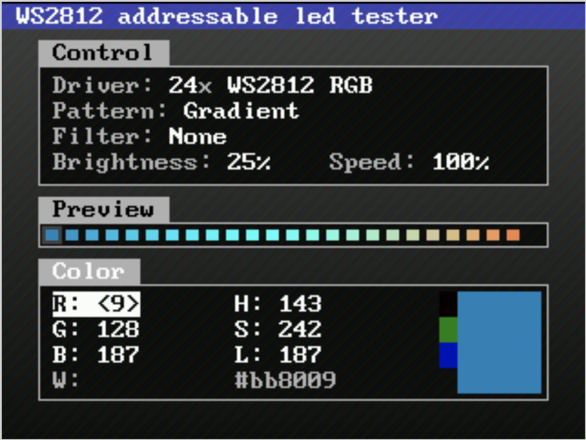

##### Temperature grapher

Shows temperature of up to 8 DS1820 sensors in form of graph. Automatic export of measured values into [html](https://rawgit.valky.eu/gabonator/LA104/master/system/apps_featured/test33_temper/visualize/TEMPER01.HTM), [source code](system/apps_featured/test33_temper/visualize/TEMPER01.HTM).

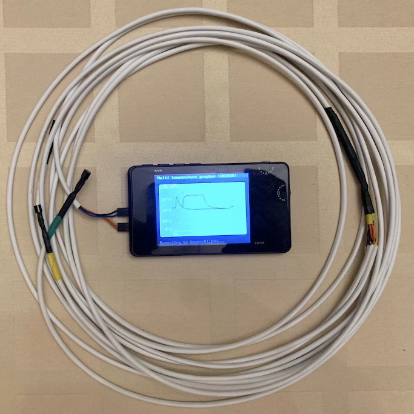
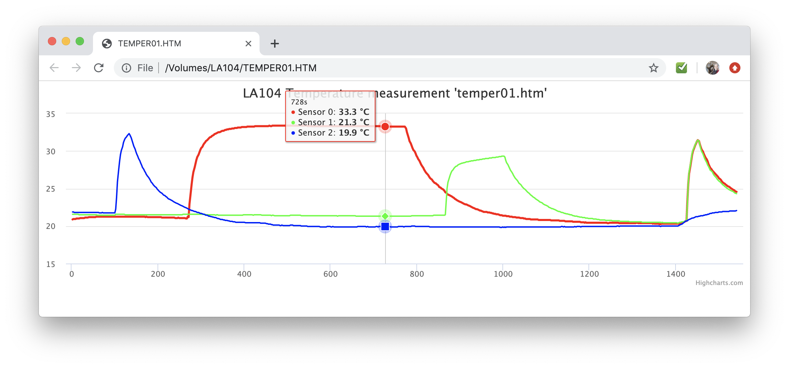

##### One firmware to rule them all

Operating system developed as a part of this project was ported to other handheld devices from miniware (DS203 rev. 2.60, DS213, LA104). Still in early development stage, but looks very promising.

##### Dream SAM2695

LA104 playing midi on SAM2695 wavetable synthesizer through UART:

##### Simcom driver

Simcom 800L driver with nice interface, sends 6 HTTP (get/post/json) requests in one minute. [test45_simcom](system/apps/test45_simcom)

##### GPIO Tool

Allows to monitor logic level on all 8 pins, the P1-P4 pins can be used as outputs. In PWM tab it is possible to set the PWM frequency and PWM levels for P1-P4 pins, including exponential compensation curve or automatic quasi-periodic animation of all outputs.

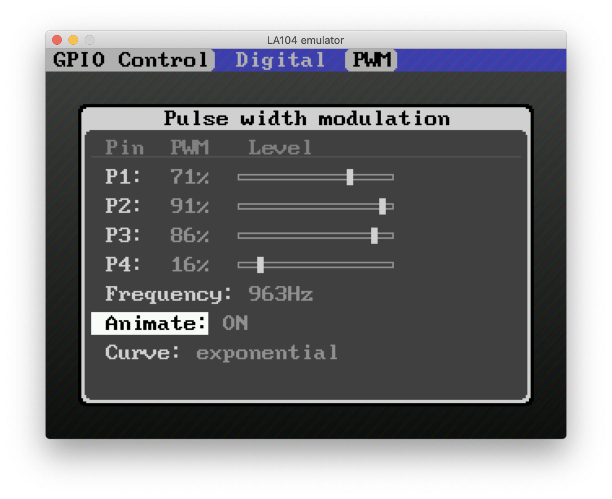

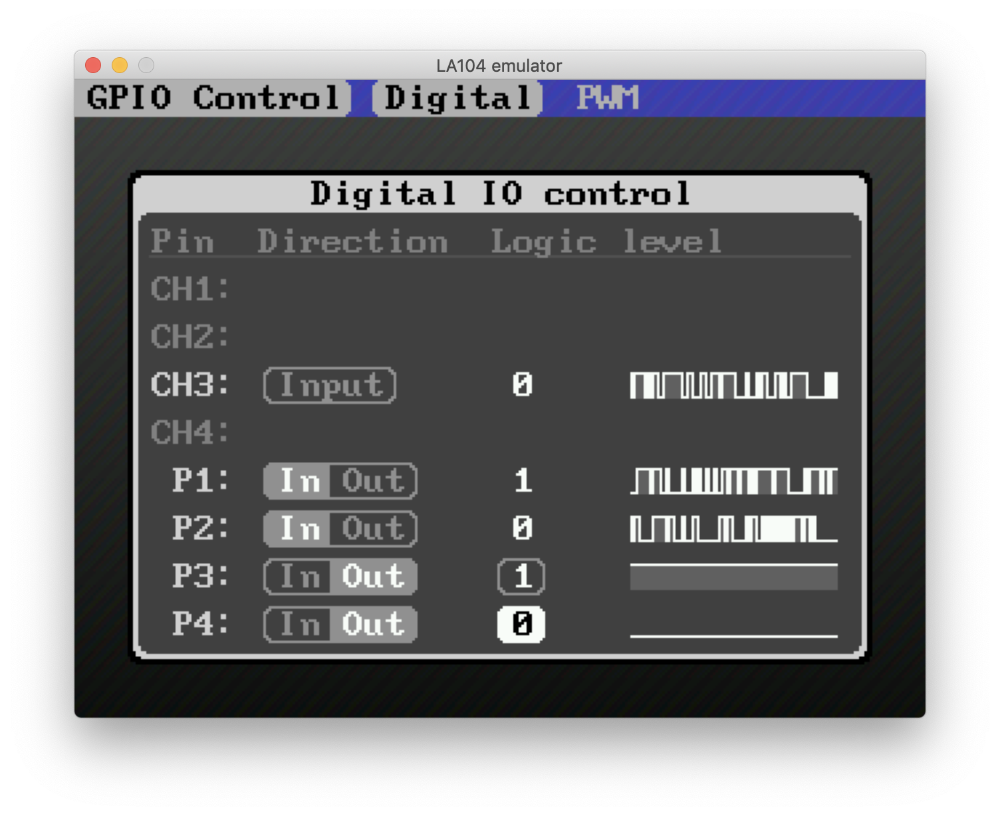

##### Wave alchemy

Currently in development stage. App sniffs for wireless transmission using CC1101 transceiver, automatically decodes the protocol (wireless weather station, KEELOQ keyfob packets, fixed code remote controls, rolling code remote controls). To aid the decoding process, app displays the sniffed signal in form of histogram for easy identification of protocol (manchester encoding, pause length encoding) and its timing. Recorded signal can be stored in flash or transferred to PC for further analysis. Stored signals can be replayed to perform replay attack in case of fixed code sequence. Besides support of CC1101 chip, this app can be used in conjunction with infrared receiver and infrared diode to record and replay IR control codes for TV set or another consumer electronics.

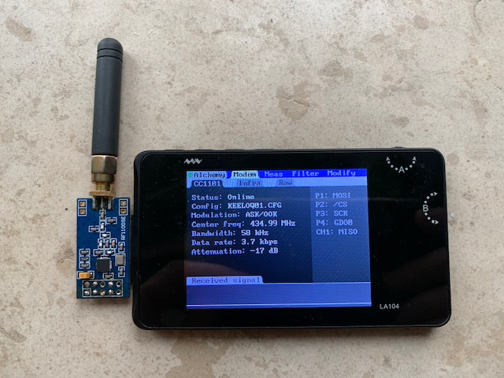

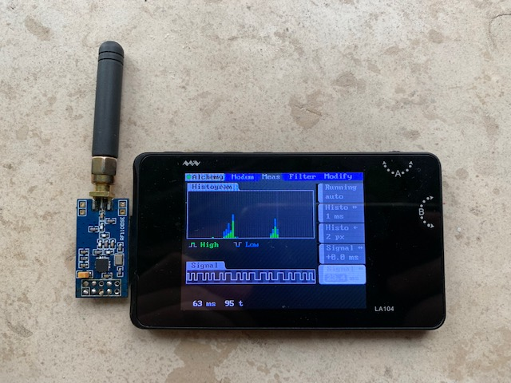

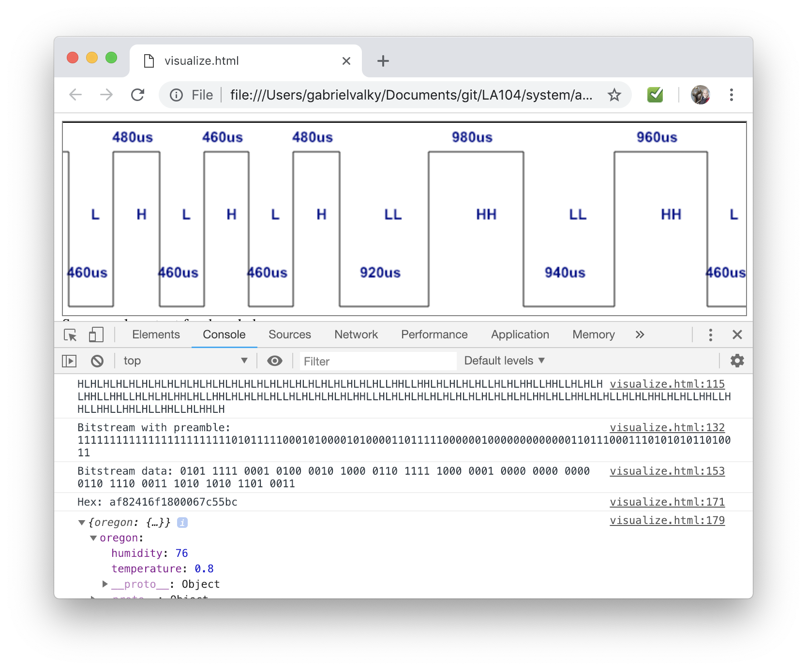

##### I2C Scanner application

I2C Scanner including database of 245 I2C devices, automatically shows description of identified device.

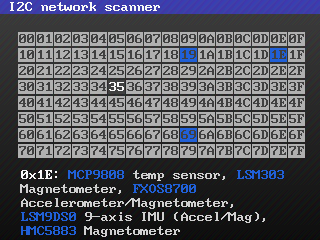

##### Pulseview compatibility

Added USB application which emulates sigrok SUMP protocol. By choosing "Openbench logic sniffer (ols)" in Pulse view configuration, LA104 can transfer measured signals to pulse view for deep analysis. Pulseview support wide range of protocols and offers intuitive user interface. Currently only 50kHz sampling is supported on P1..P4 pins, samplerate is sufficient for decoding of 9600 baud serial link.

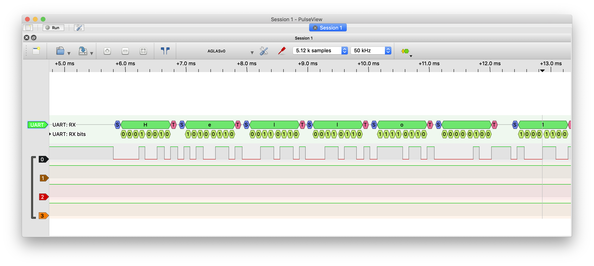

##### Graphical application chooser

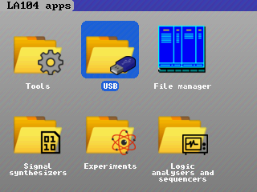

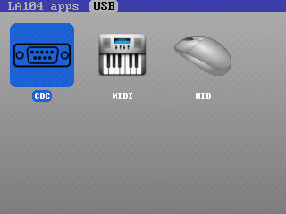

##### Stock logic analyser integration

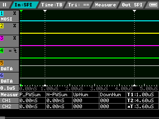

##### Logic sequencer app

16 channel logic analyser and sequencer. Generator of 4 bit pattern attached to CD4543 BCD to seven segment decoder. PCF8574 used as 16 bit expander

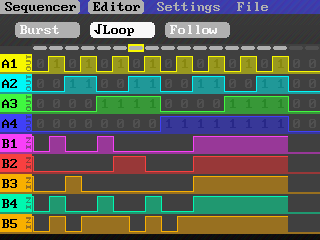

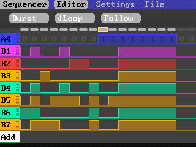

##### Midi player - midi parser and player

Connect your midi keyboard with two wires (3V and P1 through 100-330 ohm resistor).

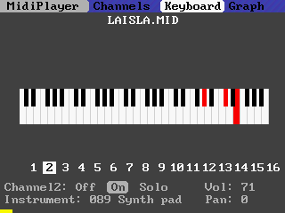

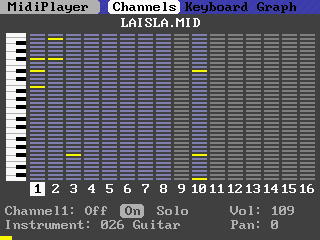

