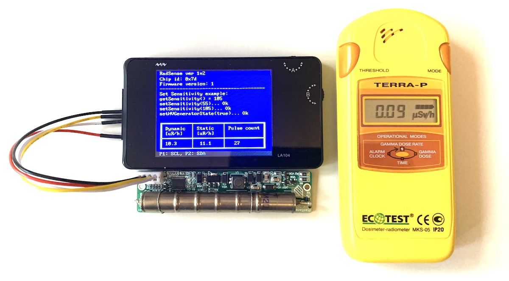

Radsense
===========

[Climateguard radsense](https://climateguard.ru/) geiger tube module. Application is based on [this github code](https://github.com/climateguard/) for arduino

## Dosimeter characteristics:
- Geiger–Muller tube: SBM 20-1
- Supported radiation range, μR / h: 14,4 ... 144 000,0
- Own background noise, no more, imp / s: 1
- Sensitivity to gamma radiation (37 Cs source), imp / μR: 160 … 75
- Spread of relative sensitivity: 15 %
- Supply voltage, V: 3,0 ... 3,5
- Maximum current consumption, mA: 50
- Connection interface: I2C
- I2C frequency, kHz: 400
- I2C address: 0x66
- SBM20-1 counter sensitivity, imp / μR: 105
- Radiation LED indication: yes
- Power LED indicator: no
- Operating temperature range, °C: -20 ... +60
- Dimensions, mm: 89 х 21 х 13,5
- Device weight (approx), g: 12

