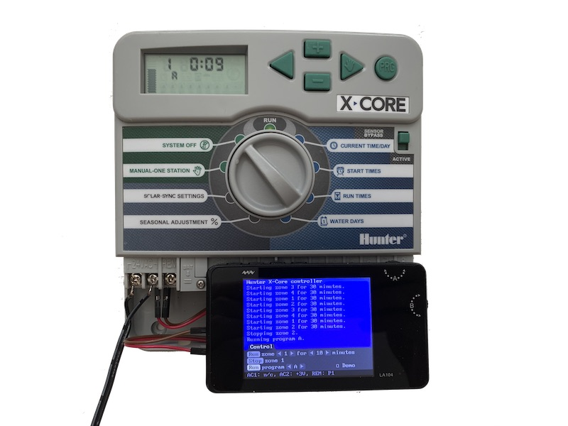

# Hunter X-core irrigation controller

Designed to work with Hunter X-Core, Pro-C, PCC, I-Core and ACC controllers through a SmartPort connection. SmartPort allows to remotely control the irrigation controller. Application can be used to turn on any of the output (up to outputs 48 depending on the model you are using) for specified time (1-240minutes). Or it can also turn on complete predefined program. Based on the code provided by Sebastien in following discussion: https://www.hackster.io/sshumate/hunter-sprinkler-wifi-remote-control-4ea918

