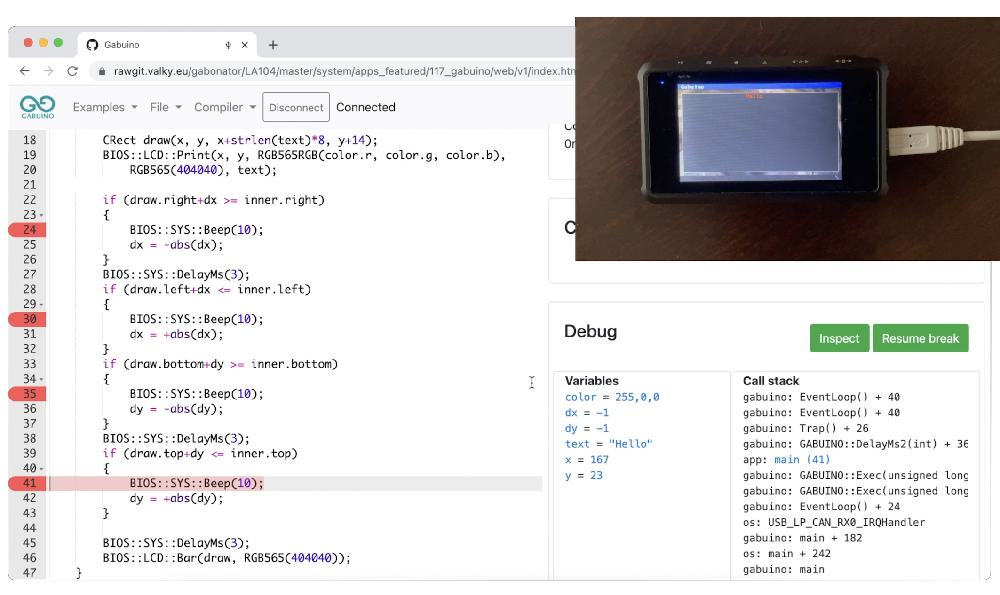

# Gabuino

Video:

In-browser development environment for STM32:
- Inspired by arduino
- /web/v1 - ACE based C++ editor
- /service - GCC compiler service which could be replaced with webassembly GCC/LLVM port later (to be able to compile even in offline mode)
- /source - LA104 user application responsible for code flashing, execution and debugging over webusb
- /examples Examples package (/examples)

The compiler is configured to place generated code into RAM, currently there are 8kB available which is plenty for simple experiments. Build times are 160ms for GCC running on the same machine or approx 500ms for cloud hosted compiler. Flashing and other stuff takes less than 20ms, all this together provide incredibly high development speed.

Features:
- debug prints redirected to HTML view - possible to use html tags, images...
- syntax highlighting
- compilation error highlighting
- taking screenshots
- realtime variable inspection with user defined formatting using [keichi's binary parser](https://github.com/keichi/binary-parser)
- stack trace decoding
- single shot breakpoints

Todos:
- porting to blue pill
- auto complete
- profiling
- hard stopping of frozen app (setjmp/longjmp)
- ssl certificate for gcc service (currently the request goes to web hosting php service -> gcc service on cloud -> back to web hosting with ssl certificate -> back to the client), but even in this scenario the compilation time is 300-5000ms

Video narration:
- There were times when the world of electronics was full of mathematics and physics and a lot of research was necessary to design complex circuits.
- As the years came by, more and more designs were based on microcontrollers. This made it possible to significantly reduce the complexity of circuit by moving the logic into computer code.
- This is an example of such design, note the green block of hexadecimal numbers. They represent the instructions which will be executed by the microcontroller.
- To start experimenting with such circuits you had to buy some breadboard, microcontroller, and some components like led diodes, resistors and cables. But you still needed the most important thing, the device which transfers the computer code into the chip, called programmer. 
- To design your program you also need some integrated development environment and a decent C compiler.
- With the advent of Arduino everything has changed. You just need one board which incorporates everything necessary for prototyping and software can be downloaded from internet for free. 
- Arduino software package contains editor, GCC compiler and flashing utility. The editor is very simple and doesn’t offer much features compared to other modern IDEs. GCC toolchain allows you to use all the features of modern C++ 
- This simple program generates random numbers in range 0 to 99. By single click the program goes through preprocessor, compiler, and then it is finally is transferred into the arduino board.
- For debugging you can use internal serial monitor, and it is possible to display your data in form of a simple chart.
- Looks like there is nothing we could improve here, but let me introduce you Gabuino - the new generation of Arduino. 
- This is DS213 device manufactured by miniware running Gabuino application. After connecting the device with your computer a popup window appears. Clicking on it opens a web based application which communicates directly with the device.
- Just by clicking on Run button, the code from integrated editor is compiled on cloud and transferred to the device. All it takes less than 300 milliseconds. This integrated environment features a lot of debugging tools, for example you can take a screenshot. Or you can download the ELF file which can be executed directly through the LA104 operating system. For curious minds there is option to download the assembly as well.
- All debugging messages are redirected into the web application. This means that you can use all the features of HTML language to create rich debugging reports.
- And that’s not all - since we are living in a web browser, we can use any javascript framework just by including it with script tag. What about a realtime chart showing temperature or voltage?
- Simply instantiate a chart component through debugging messages and feed it with live data.  Highcharts component allows    exporting into PDFs, so it is a great choice for logging and science experiments.
- What about a colour picker? Absolutely no problem, it is possible to bidirectionally communicate between the unit and web application.
- I have found this nice and very short implementation of flappy bird game in javascript. Instead of controlling the bird with keyboard or mouse, we control it by clicking the buttons of the DS213 device
- This application shows that even mouse touch events can be transferred into the device to create minimalistic image drawing tool.
- You can use any javascript library for visualisation of your data. To use the WebGl technology to enter the world of 3D I have used library called ThreeJS. The cube rotation is controlled by the navigation encoders on the device. 
- Integration with online services is also possible - here we transfer random picture of a cat from cat as a service webpage into the devices screen.
- Back to the debugging features. By clicking on Inspect button you will get full stack listing and a list of variables with the ability to change them during application runtime. 
- We can change the colour to green, or to yellow, check the variables as they change in time, double the horizontal speed, set the vertical speed to zero or change the displayed message. Everything is under our control.
- We can go even further. This is the same application with some light improvements. It plays a sound when the flying message hits any of the walls.
- Let’s change it a little bit - add there more delays so we can verify if the call stack listing is pointing to the right line of code
- Clicking on the highlighted lines in this window reveals the function which being executed. Let’s try it more times to see where the program spends most of the time.
- Now we will set breakpoints in every case when the text is bouncing off the walls. We can see that execution of our program was stopped because we hit the breakpoint. Clicking on “resume break” button deletes the break point and continues the program execution. This time the x coordinate was too low, so we are bouncing off the left wall.
- This is the bottom wall. And finally the last one.
- Enough theory, let’s see it in action. What we have here is a bunch of metal and plastic nuts and a calliper with digital interface connected to LA104. Short code decodes the packets sent over the synchronous link and displays the measurement in milli meters. When the measurement matches one of the metric nut sizes, it will show the size of the nut. and After beeping it increments the count of nuts of specific size and displays everything in form of a table.
- Gabuino is a great choice for industrial automation, science projects, protocol hacking and prototyping. It is fast and offers wide variety of visualisation options  without installation of any software.
- Currently it runs on STM32 based boards, but it is easily possible t extend the compatiblity with any microcontroller board with sufficient memory size.
- Pretty cool when you compare it with Arduino, don’t you think?
