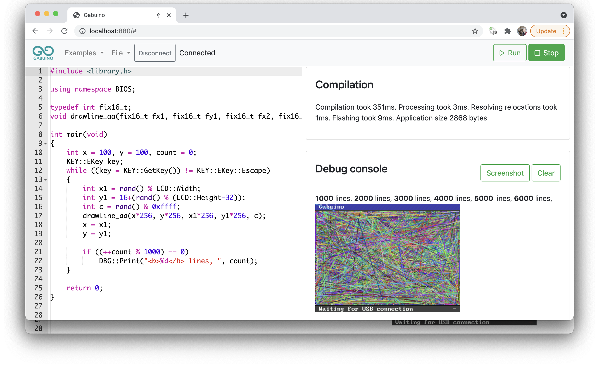

# Gabuino

Video:

In-browser development environment for STM32:
- Inspired by arduino
- /web/v1 - ACE based C++ editor
- /service - GCC compiler service which could be replaced with webassembly GCC/LLVM port later (to be able to compile even in offline mode)
- /source - LA104 user application responsible for code flashing, execution and debugging over webusb
- /examples Examples package (/examples)

The compiler is configured to place generated code into RAM, currently there are 8kB available which is plenty for simple experiments. Build times are 160ms for GCC running on the same machine or approx 500ms for cloud hosted compiler. Flashing and other stuff takes less than 20ms, all this together provide incredibly high development speed.

Features:
- debug prints redirected to HTML view - possible to use html tags, images...
- syntax highlighting
- compilation error highlighting
- taking screenshots
- realtime variable inspection with user defined formatting using [keichi's binary parser](https://github.com/keichi/binary-parser)
- stack trace decoding
- single shot breakpoints

Todos:
- porting to blue pill
- auto complete
- profiling
- hard stopping of frozen app (setjmp/longjmp)
- ssl certificate for gcc service (currently the request goes to web hosting php service -> gcc service on cloud -> back to web hosting with ssl certificate -> back to the client), but even in this scenario the compilation time is 300-5000ms