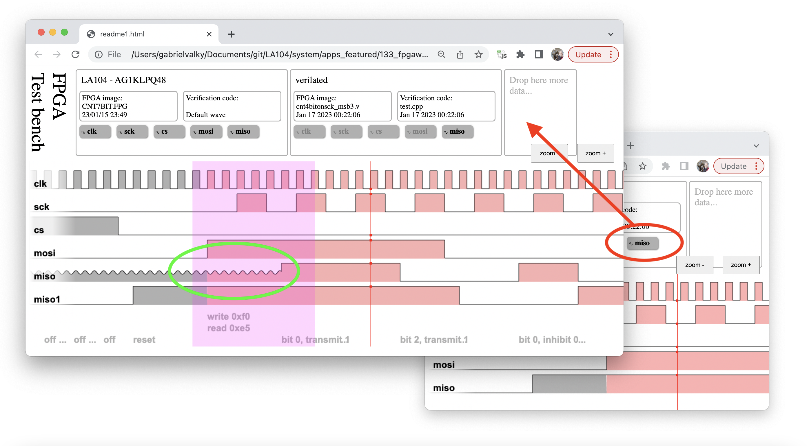

# FPGA test bench

[Sample recording1](https://rawgit.valky.eu/gabonator/LA104/master/system/apps_featured/133_fpgawave/res/readme1.html)
[Sample recording2](https://rawgit.valky.eu/gabonator/LA104/master/system/apps_featured/133_fpgawave/res/readme2.html)

Drag dropping signals between multiple windows (displaying high impedance state!):

Detail with verilator/testbench messages:

Testbench code:

Online synthesis service:

