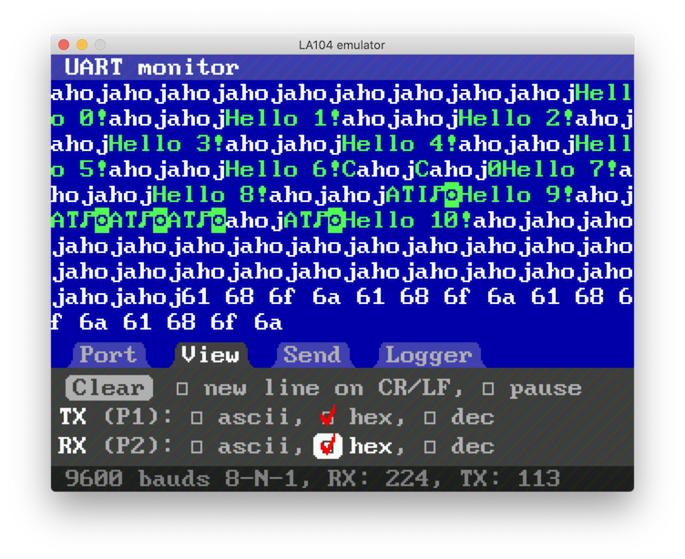
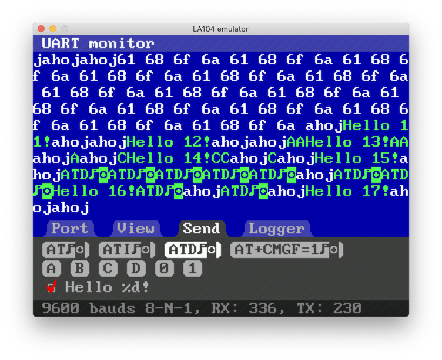
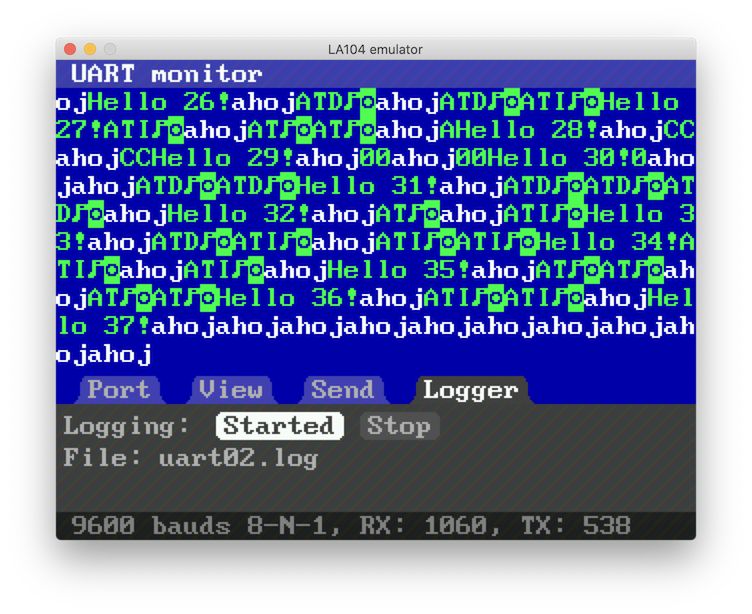
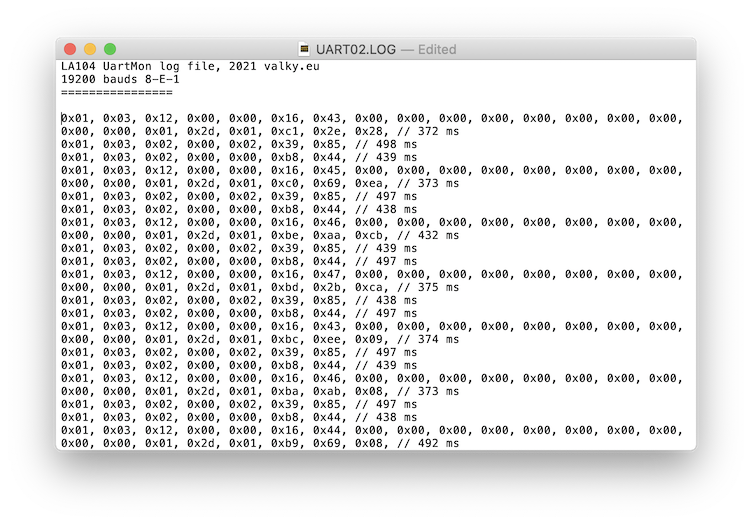

# Uart monitor

Advanced uart monitor using internal harware uart.

## Port configuration


## View formatting



## Sending



## Logging



## Sample log



[log file](res/uart02.log)


```
LA104 UartMon log file, 2021 valky.eu
19200 bauds 8-E-1
================

0x01, 0x03, 0x02, 0x00, 0x02, 0x39, 0x85, // 498 ms
0x01, 0x03, 0x02, 0x00, 0x00, 0xb8, 0x44, // 439 ms
0x01, 0x03, 0x02, 0x00, 0x02, 0x39, 0x85, // 497 ms
0x01, 0x03, 0x02, 0x00, 0x00, 0xb8, 0x44, // 438 ms
0x01, 0x03, 0x02, 0x00, 0x02, 0x39, 0x85, // 439 ms
0x01, 0x03, 0x02, 0x00, 0x00, 0xb8, 0x44, // 497 ms
0x01, 0x03, 0x02, 0x00, 0x02, 0x39, 0x85, // 438 ms
0x01, 0x03, 0x02, 0x00, 0x00, 0xb8, 0x44, // 497 ms
```

## Uart monitor connections

```
P1 - output
P2 - input
```
