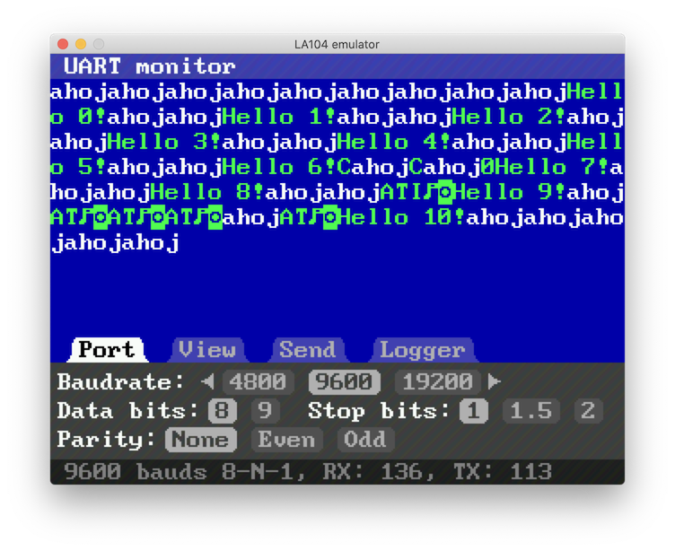

# Uart monitor

Advanced uart monitor using internal harware uart.

## Port configuration




## View formatting


## Sending


## Logging


## Sample log


[log file](res/uart02.log)


```
LA104 UartMon log file, 2021 valky.eu
19200 bauds 8-E-1
================

LA104 UartMon log file, 2021 valky.eu
19200 bauds 8-E-1
================

0x01, 0x03, 0x12, 0x00, 0x00, 0x16, 0x43, 0x00, 0x00, 0x00, 0x00, 0x00, 0x00, 0x00, 0x00, 0x00, 0x00, 0x01, 0x2d, 0x01, 0xc1, 0x2e, 0x28, // 372 ms
0x01, 0x03, 0x02, 0x00, 0x02, 0x39, 0x85, // 498 ms
0x01, 0x03, 0x02, 0x00, 0x00, 0xb8, 0x44, // 439 ms
0x01, 0x03, 0x12, 0x00, 0x00, 0x16, 0x45, 0x00, 0x00, 0x00, 0x00, 0x00, 0x00, 0x00, 0x00, 0x00, 0x00, 0x01, 0x2d, 0x01, 0xc0, 0x69, 0xea, // 373 ms
0x01, 0x03, 0x02, 0x00, 0x02, 0x39, 0x85, // 497 ms
0x01, 0x03, 0x02, 0x00, 0x00, 0xb8, 0x44, // 438 ms
0x01, 0x03, 0x12, 0x00, 0x00, 0x16, 0x46, 0x00, 0x00, 0x00, 0x00, 0x00, 0x00, 0x00, 0x00, 0x00, 0x00, 0x01, 0x2d, 0x01, 0xbe, 0xaa, 0xcb, // 432 ms
0x01, 0x03, 0x02, 0x00, 0x02, 0x39, 0x85, // 439 ms
0x01, 0x03, 0x02, 0x00, 0x00, 0xb8, 0x44, // 497 ms
0x01, 0x03, 0x12, 0x00, 0x00, 0x16, 0x47, 0x00, 0x00, 0x00, 0x00, 0x00, 0x00, 0x00, 0x00, 0x00, 0x00, 0x01, 0x2d, 0x01, 0xbd, 0x2b, 0xca, // 375 ms
0x01, 0x03, 0x02, 0x00, 0x02, 0x39, 0x85, // 438 ms
0x01, 0x03, 0x02, 0x00, 0x00, 0xb8, 0x44, // 497 ms
0x01, 0x03, 0x12, 0x00, 0x00, 0x16, 0x43, 0x00, 0x00, 0x00, 0x00, 0x00, 0x00, 0x00, 0x00, 0x00, 0x00, 0x01, 0x2d, 0x01, 0xbc, 0xee, 0x09, // 374 ms
0x01, 0x03, 0x02, 0x00, 0x02, 0x39, 0x85, // 497 ms
0x01, 0x03, 0x02, 0x00, 0x00, 0xb8, 0x44, // 439 ms
0x01, 0x03, 0x12, 0x00, 0x00, 0x16, 0x46, 0x00, 0x00, 0x00, 0x00, 0x00, 0x00, 0x00, 0x00, 0x00, 0x00, 0x01, 0x2d, 0x01, 0xba, 0xab, 0x08, // 373 ms
0x01, 0x03, 0x02, 0x00, 0x02, 0x39, 0x85, // 497 ms
0x01, 0x03, 0x02, 0x00, 0x00, 0xb8, 0x44, // 438 ms
```

## Uart monitor connections

```
P1 - output
P2 - input
```
