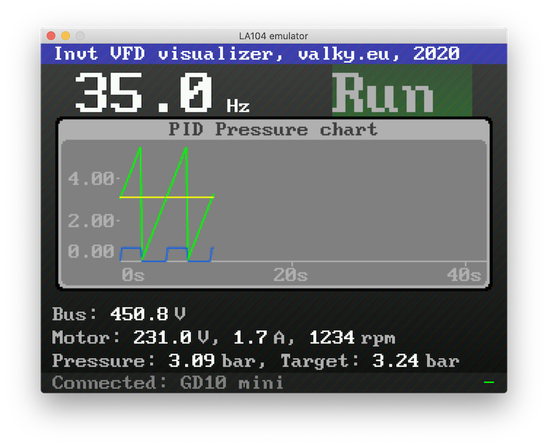
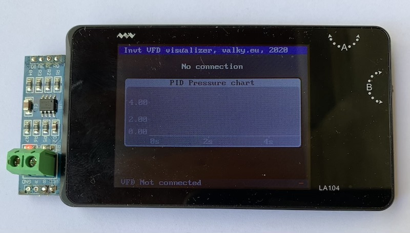
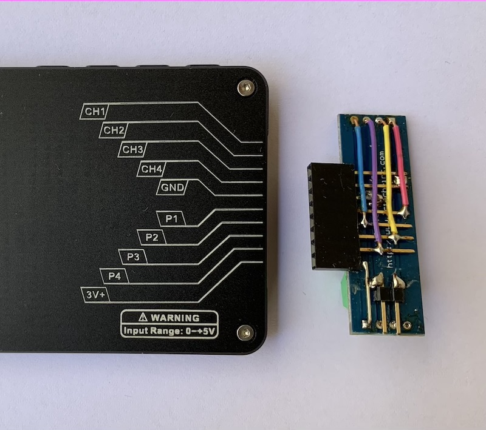

# Invt variable frequency drive tool

This application communicates with Invt VFDs (tested on GD10 mini), shows realtime information of the system (system state, frequecny, voltage, current, speed, pid). In [experiments](../../apps_experiments/) folder, there is also some simple RS485 commnication debugger and GD10 simulator. You will need MAX485 adapter, connect P1 to DI, P2 to RO, P3 to DE, P4 to RE. The converter can be powered directly from internal 3V voltage source. Serial port is configured to 19200 bauds, with even parity.

Video:

Application screenshot:

RS485 module attached to LA104:

Module connections:

One LA104 acting as GD100 emulator:

